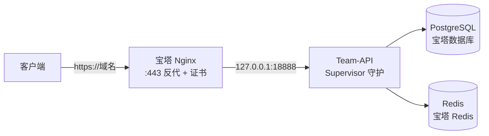

# 宝塔部署

[宝塔面板](https://www.bt.cn)是国内流行的服务器运维面板，可以把 Nginx、数据库、进程守护、SSL 证书全部在图形界面完成，适合不熟命令行的运维同学。本页在[二进制部署](/deploy/binary)的基础上，把每个环节换成面板操作：**宝塔装软件 → 建库 → 上传二进制 → 进程守护 → 反向代理 + HTTPS**。



## 第一步：安装面板与软件

1. 参照[宝塔官网](https://www.bt.cn/new/download.html)选择对应系统的安装脚本完成面板安装；
2. 面板首页选择 **LNMP**，安装 **Nginx**；
3. 打开 **软件商店**，依次安装：

| 软件 | 用途 |
|------|------|
| PostgreSQL 管理器 | 安装 PostgreSQL 15+（有 18 选 18），创建 `team_api` 库 |
| Redis | 额度账本与缓存，安装后在设置中**开启密码并启用 AOF 持久化** |
| 进程守护管理器 | Supervisor 封装，用来守护 Team-API 进程 |

## 第二步：创建数据库与 Redis

1. **数据库 → PostgreSQL → 添加数据库**：库名 `team_api`、设置访问密码，权限选「本地服务器」；
2. **Redis 设置**：开启 `requirepass` 并记下密码（建议同时开启 AOF，计费相关状态落在 Redis，重启不丢账）。

::: tip 软件商店没有合适的 PostgreSQL？
任何方式装的 PostgreSQL 15+ / Redis 7+ 都可以（Docker、手动安装、云 RDS），Team-API 只认 `config.yaml` 里的连接串，不关心数据库怎么装的。
:::

## 第三步：上传程序与配置

通过面板**文件**功能（或 SFTP）把二进制部署产物传到服务器：

```text
/opt/team-api/
├── team-api              # GitHub Releases 下载的 linux-amd64 二进制
├── config/
│   └── config.yaml       # 运行时配置
└── logs/
```

`config.yaml` 关键项（数据库与 Redis 用上一步创建的本地实例）：

```yaml
server:
  address: ":18888"

database:
  default:
    link: "pgsql:team_api:数据库密码@tcp(127.0.0.1:5432)/team_api?sslmode=disable"

redis:
  default:
    address: "127.0.0.1:6379"
    pass: "Redis密码"

jwt:
  secret: "openssl rand -hex 32 生成"

crypto:
  encryptionKey: "openssl rand -hex 32 生成"   # 必填，务必备份
```

在面板**终端**中设置权限：

```bash
chmod +x /opt/team-api/team-api
```

首次启动前的初始化（`/setup` 向导或 `INIT_ADMIN_*` 环境变量）与[二进制部署](/deploy/binary)完全一致。

## 第四步：进程守护

打开**软件商店 → 进程守护管理器 → 设置 → 添加守护进程**：

| 字段 | 填写 |
|------|------|
| 名称 | `team-api` |
| 启动用户 | `root` 或自建用户 |
| 运行目录 | `/opt/team-api` |
| 启动命令 | `/opt/team-api/team-api` |
| 进程数量 | `1`（有状态网关不可多开） |

保存后状态变为「运行中」。此时浏览器访问 `http://服务器IP:18888` 应能打开初始化向导，完成后即可通过进程守护管理器启停、查看日志。

::: tip 与在线更新
Supervisor 托管不影响管理后台在线更新：Team-API 升级是原地换壳（PID 不变），详见[二进制部署 · 版本升级](/deploy/binary#版本升级)。
:::

## 第五步：反向代理

1. **网站 → 添加站点**：域名填解析到本机的域名，PHP 版本选「纯静态」；
2. 站点**设置 → 反向代理 → 添加反向代理**：目标 URL 填 `http://127.0.0.1:18888`，发送域名默认即可；
3. **关键**：宝塔默认反代模板面向普通网站，对流式接口需要手动补充配置。在反向代理列表点击**配置文件**，在 `location /` 中核对/补充以下内容：

```nginx
location /
{
    proxy_pass http://127.0.0.1:18888;

    proxy_set_header Host $host;
    proxy_set_header X-Real-IP $remote_addr;
    proxy_set_header X-Forwarded-For $proxy_add_x_forwarded_for;
    proxy_set_header REMOTE-HOST $remote_addr;

    # --- 流式（SSE）与实时（WebSocket）必需 ---
    proxy_buffering off;                  # 关闭缓冲，SSE 逐块下发
    proxy_cache off;
    proxy_read_timeout 600s;              # 长回答不被 60s 默认超时切断
    proxy_send_timeout 600s;
    proxy_http_version 1.1;
    proxy_set_header Upgrade $http_upgrade;
    proxy_set_header Connection "upgrade";
}
```

同时在站点主配置（**设置 → 配置文件**）的 `server` 块中加上传上限（音频转写等接口需要）：

```nginx
client_max_body_size 100m;
```

保存后自动 reload。各配置项的原理与排错见 [Nginx 反向代理](/deploy/nginx)。

## 第六步：HTTPS 证书

站点**设置 → SSL → Let's Encrypt**：勾选域名，文件验证方式一键签发，然后开启**强制 HTTPS**。证书到期面板自动续期。

::: tip 安全组与端口
启用反代后，**只需放行 80 / 443**。18888 是内部端口，请在宝塔**安全**页与云厂商安全组中确保不对公网开放。
:::

## 日常运维

| 操作 | 入口 |
|------|------|
| 启停 / 重启 / 日志 | 软件商店 → 进程守护管理器 |
| 数据库备份 | 数据库 → PostgreSQL → 备份（可定期自动备份到面板存储） |
| 版本升级 | 管理后台左上角在线更新（推荐），或文件管理手动替换二进制后重启守护进程 |
| 访问日志 | 网站 → 站点设置 → 日志 |

升级前记得先做一次数据库备份；在线更新的原理与回滚见[二进制部署 · 版本升级](/deploy/binary#版本升级)。

## 下一步

- [Nginx 反向代理](/deploy/nginx) —— 反代各项配置的原理详解
- [Supervisor 进程守护](/deploy/supervisor) —— 进程守护管理器背后的配置细节
- [排障指南](/troubleshooting/) —— 部署完成后的常见问题定位
