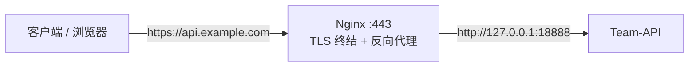

# Nginx 反向代理

生产环境建议不要把 Team-API 直接暴露公网，而是前置一层 Nginx：终结 HTTPS、隐藏真实端口、附带静态资源压缩与访问控制。Team-API 的流式接口（SSE）与实时接口（WebSocket）对代理配置有几处**硬性要求**，照抄本页配置即可避坑。



## 最小可用配置

`/etc/nginx/conf.d/team-api.conf`：

```nginx
server {
    listen 80;
    server_name api.example.com;

    # HTTP 全部跳转 HTTPS
    return 301 https://$host$request_uri;
}

server {
    listen 443 ssl;
    http2 on;
    server_name api.example.com;

    # 证书路径（可用 certbot / acme.sh 签发，见下文）
    ssl_certificate     /etc/nginx/ssl/api.example.com.pem;
    ssl_certificate_key /etc/nginx/ssl/api.example.com.key;
    ssl_protocols       TLSv1.2 TLSv1.3;

    # 上传体积：音频转写等接口需要传入文件，Nginx 默认 1m 会直接 413
    client_max_body_size 100m;

    location / {
        proxy_pass http://127.0.0.1:18888;

        # 基础透传
        proxy_set_header Host              $host;
        proxy_set_header X-Real-IP         $remote_addr;
        proxy_set_header X-Forwarded-For   $proxy_add_x_forwarded_for;
        proxy_set_header X-Forwarded-Proto $scheme;

        # ---------- 流式与长连接的关键配置 ----------
        # SSE 流式响应：必须关闭缓冲，否则对话会整段攒完才吐给客户端
        proxy_buffering off;
        proxy_cache off;

        # 流式对话可能持续数分钟，默认 60s 超时会掐断长回答
        proxy_read_timeout    600s;
        proxy_send_timeout    600s;

        # WebSocket（/v1/realtime 实时接口）
        proxy_http_version 1.1;
        proxy_set_header Upgrade    $http_upgrade;
        proxy_set_header Connection $connection_upgrade;
    }
}
```

在 `http` 块（通常已在 `/etc/nginx/nginx.conf` 中）补充 WebSocket 连接映射：

```nginx
map $http_upgrade $connection_upgrade {
    default upgrade;
    ''      close;
}
```

启用：

```bash
nginx -t          # 校验语法
systemctl reload nginx
```

## 关键配置逐项说明

| 配置 | 作用 | 不配的后果 |
|------|------|-----------|
| `proxy_buffering off` | 响应逐块透传 | SSE 被 Nginx 攒成整段，客户端等几十秒后一次性收到全部内容，看起来像「卡死」 |
| `proxy_read_timeout 600s` | 等待上游响应的超时 | 长回答 / 慢模型生成超过 60s 即被切断（客户端侧表现为响应中断） |
| `proxy_http_version 1.1` + `Upgrade` 头 | WebSocket 升级握手 | `/v1/realtime` 无法建立连接 |
| `client_max_body_size 100m` | 请求体上限 | Nginx 默认 1MB，音频转写、图片生成接口直接 413 |

::: warning 应用层还有一个 8MB 上限
Team-API（GoFrame）默认限制请求体 **8MB**（`client_max_body_size` 只管 Nginx 这一侧）。需要上传更大音频 / 图片文件时，在 `config.yaml` 中同步放宽：

```yaml
server:
  address: ":18888"
  clientMaxBodySize: 104857600   # 单位字节，示例为 100MB
```

修改后重启应用生效。
:::

## 证书签发与续期

**certbot（Let's Encrypt 官方推荐）：**

```bash
# 签发：自动修改 Nginx 配置并注册续期定时任务
sudo certbot --nginx -d api.example.com

# 续期默认由 systemd timer 自动执行，手动验证一次：
sudo certbot renew --dry-run
```

**acme.sh（国内 DNS API 签发泛域名证书常用）：**

```bash
acme.sh --issue -d api.example.com --nginx
acme.sh --install-cert -d api.example.com \
  --key-file /etc/nginx/ssl/api.example.com.key \
  --fullchain-file /etc/nginx/ssl/api.example.com.pem \
  --reloadcmd "systemctl reload nginx"
```

## 常用增强（可选）

```nginx
server {
    # ...接上文 server 块...

    # 压缩 JSON 响应（注意：SSE 由 proxy_buffering off 直传，不受影响）
    gzip on;
    gzip_types application/json;

    # 限速防刷：每 IP 10 请求/秒，突发 20
    limit_req_zone $binary_remote_addr zone=api_limit:10m rate=10r/s;
    limit_req zone=api_limit burst=20 nodelay;

    # 只信任一级代理追加的 X-Forwarded-For，避免伪造
    proxy_set_header X-Forwarded-For $remote_addr;

    # 访问与错误日志单独存放
    access_log /var/log/nginx/team-api.access.log;
    error_log  /var/log/nginx/team-api.error.log;
}
```

::: tip 获取真实客户端 IP
按上文配置 `X-Real-IP` / `X-Forwarded-For` 后，Team-API 请求日志中记录的即是真实客户端 IP，而非 127.0.0.1。若前面还有 CDN（如 Cloudflare），需改为透传 CDN 的回源头（如 `CF-Connecting-IP`），并在 Nginx 侧配 `real_ip_header` / `set_real_ip_from`。
:::

## 验证

```bash
# 健康检查走一遍代理链路
curl https://api.example.com/api/health

# 验证 SSE 流式：响应应逐块到达（-N 关闭 curl 缓冲）
curl -N https://api.example.com/v1/chat/completions \
  -H "Authorization: Bearer sk-xxxx" \
  -H "Content-Type: application/json" \
  -d '{"model":"gpt-4o-mini","stream":true,"messages":[{"role":"user","content":"数到10"}]}'
```

流式输出若一次性整段到达，说明 `proxy_buffering` 未生效；中途断开则检查 `proxy_read_timeout`。

## 下一步

- [宝塔部署](/deploy/baota) —— 面板图形界面完成同样的反代 + 证书配置
- [Supervisor 进程守护](/deploy/supervisor) · [systemd 进程守护](/deploy/systemd) —— 后端进程的开机自启与崩溃拉起
- [排障指南](/troubleshooting/) —— 流式中断、502/504 的定位思路
