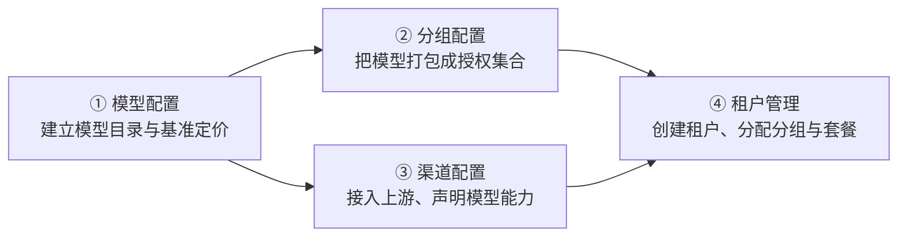

# 管理后台

管理后台面向**平台运营方**，承担全局资源与租户运营：模型目录与定价、上游渠道接入与调度、租户生命周期与授权、财务与监控审计。它与面向终端用户的[租户控制台](/guide/tenant/)是两套独立的账号体系。

## 上手顺序

从零配置到对外提供服务，推荐按以下顺序（① → ④）：

1. **[模型配置](/guide/admin/models)** —— 录入对外模型名、分类与能力，设置基准定价（可一键拉取官方参考价）；
2. **[分组配置](/guide/admin/model-groups)** —— 把模型组织成分组，并设置新租户默认分组；
3. **[渠道配置](/guide/admin/channels)** —— 接入上游供应商，在渠道上声明模型能力、映射上游模型名、设置调度层级与权重；
4. **[租户管理](/guide/admin/tenants)** —— 创建租户并分配分组 / 套餐，租户即可在控制台签发 Key 调用。

## 模块导览

| 菜单分组 | 主要功能 | 文档 |
|---|---|---|
| 数据看板 | 仪表盘、实时监控 | 🚧 编写中 |
| 大模型 | **模型列表、模型分组、渠道管理**、任务日志、用量日志、请求审计日志 | [模型配置](/guide/admin/models) · [分组配置](/guide/admin/model-groups) · [渠道配置](/guide/admin/channels) |
| 租户管理 | 租户列表、租户详情、租户级别、成员列表 | [租户管理](/guide/admin/tenants) |
| 财务中心 | 套餐、订单、交易流水、兑换码、优惠码 | 🚧 编写中 |
| 安全审计 | 登录历史、会话管理、权限管理、操作日志 | 🚧 编写中 |
| 运营管理 | 通知模板、消息、公告、工单、反馈、用户协议、帮助中心 | 🚧 编写中 |
| 运维监控 | 系统监控、流量流向、模型性能、告警规则 / 记录、渠道错误监控、拦截日志、定时任务 | 🚧 编写中 |
| 系统 | 用户管理、插件管理、系统设置、文件管理、支付设置 | [系统设置总览](/config/settings-overview) |

::: tip 权限说明
渠道的启用 / 禁用、重置健康度、删除等操作按权限点控制（如 `channel:edit`、`channel:delete`），可在「安全审计 → 权限管理」中为不同运营角色分配。
:::

## 最佳实践

- **渠道接入 checklist** —— 创建渠道 → 声明模型能力（必要时映射上游模型名）→ 详情页「测试」验证连通 → 观察健康趋势确认稳定；同模型至少两条渠道互为冗余，按「首选 / 备用 / 保底」分层；
- **告警阈值建议** —— 渠道健康度持续低于 50、错误率抬升时触发告警，配合自动禁用策略减少夜间人工介入，详见[系统设置 → 渠道配置](/config/settings-channel)；
- **变更留痕** —— 全部管理操作记录在操作日志，渠道问题用 Request ID 在[排障指南](/troubleshooting/)的链路中定位。
