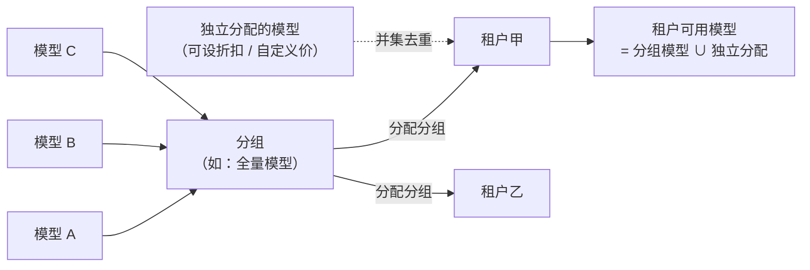

# 分组配置

**管理后台 → 大模型 → 模型分组**

模型分组是**模型的授权集合**：把若干模型打包成一个分组，再把分组分配给租户，组内模型即对该租户可用。相比逐个租户逐个模型地分配，分组让「新增模型」「新增租户」都变成一处修改、批量生效。

租户的**实际可用模型 = 所有已授权分组内模型的并集 + 独立分配的模型**（去重，独立分配的定价配置优先生效）。分组只做授权，不承载定价；租户级折扣与自定义价在[独立分配](#分配给租户)时设置。

## 分组列表

列表按名称 / 标识搜索、按状态筛选，展示每个分组的**模型数**与**租户数**。页面顶部会提示：

::: warning 默认分组告警
当前没有「启用中且标记为默认」的分组时，列表上方会出现警告——**新注册租户将无法使用任何模型**。部署后请至少创建一个默认分组。
:::

## 创建分组

| 字段 | 说明 |
|---|---|
| 分组名称 | 展示名，如「全量模型」「基础对话」 |
| 分组标识 | 唯一且**创建后不可修改**，如 `full_access`、`basic_chat` |
| 描述 | 选填，说明分组用途 |
| 设为新租户默认分组 | 开启后，**新注册的租户自动关联此分组**；允许多个分组同时为默认，新租户会全部关联 |

## 管理模型

分组行的「管理模型」打开穿梭框，从平台[模型列表](/guide/admin/models)中勾选组内模型，保存后**全量替换**该分组的模型集合：

- 把新上线的模型加入分组，**组内全部租户即时生效**（相关租户的可用模型缓存自动失效）；
- 把模型移出分组，组内租户立刻失去该模型（除非另行独立分配）——批量下架某模型时注意评估影响面，可先参考各分组的「租户数」。

## 启用 / 禁用与删除

| 操作 | 行为 |
|---|---|
| 禁用分组 | 分组保留，但不再参与租户可用模型计算（已关联租户的授权关系保留） |
| 启用分组 | 恢复参与计算 |
| 删除分组 | **有关联租户时禁止删除**——先在租户详情中解除关联，或转移租户到其他分组 |

## 分配给租户

分组与租户的绑定在**租户详情 → 模型配置**中完成，与独立模型分配同页：

- **分配分组** —— 穿梭框勾选分组，「选择分组后，分组内的所有模型自动对该租户可用」；
- **独立模型** —— 在分组之外单独给租户开模型，并可逐模型设置**折扣比例、按次计费单价、自定义输入 / 输出 / 缓存价格、阶梯价与模型级并发上限**；
- **查看可用模型** —— 汇总展示该租户最终可用的模型清单，每行标注来源（**分组** / **独立分配**），是排查「租户为什么（不）能用某模型」的第一入口。

两类授权的分工：

| | 分组授权 | 独立分配 |
|---|---|---|
| 粒度 | 一批租户 × 一批模型 | 单个租户 × 单个模型 |
| 定价 | 按模型[基准价](/guide/admin/models#模型定价)结算 | 可叠加折扣或自定义价 |
| 适用 | 套餐档次、标准目录 | 大客户专属模型、个别议价 |

## 典型场景

- **默认全量组** —— 创建标记为默认的「全量模型」分组，新租户注册即获得标准目录；
- **分级目录** —— 「基础对话」组只含低成本模型给免费档，「全量模型」组含旗舰模型给付费档，配合套餐售卖；
- **VIP 专属** —— 高价值模型单独成组，仅分配给 VIP 租户，并与[渠道的 VIP 设置](/guide/admin/channels#vip-设置折叠面板)配合，让这些租户同时优先使用优质渠道。

## 相关文档

- [模型配置](/guide/admin/models) —— 分组内的模型来自平台模型目录
- [渠道配置](/guide/admin/channels) —— 授权之后，由渠道实际承接请求
- [计费与对账](/guide/billing) —— 基准价、折扣与自定义价的结算规则
