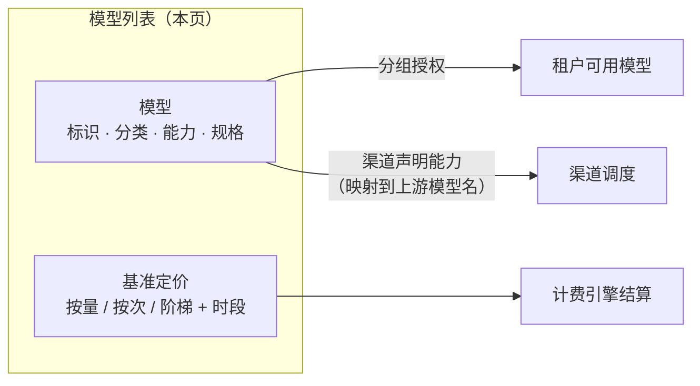

# 模型配置

**管理后台 → 大模型 → 模型列表**

模型列表是平台对外的**模型目录**：对外模型名、分类、能力、上下文规格与基准定价都在这里维护。目录中的模型与上游渠道解耦——同一个模型名可以由多个渠道提供服务，调用方始终使用平台模型名。

一个模型要能被租户实际调用，需同时满足三个条件：

1. **目录启用** —— 模型存在于列表中且状态为「启用」；
2. **租户可用** —— 模型在租户被授权的[分组](/guide/admin/model-groups)内，或[独立分配](/guide/admin/model-groups#分配给租户)给了该租户；
3. **有渠道承接** —— 至少一个启用中的[渠道](/guide/admin/channels)在「模型能力」里声明了该模型（见[可用渠道](#模型列表)列）。

## 模型列表

列表支持按**分类**（对话 / 向量 / 图像 / 音频 / 视频 / 重排）、**状态**、**定价状态**（已定价 / 未定价）筛选，按模型名搜索，并可导出 CSV / Excel 报表。

| 列 | 说明 |
|---|---|
| 模型标识 | API 请求中 `model` 参数使用的名称，全局唯一 |
| 显示名 | 面向人的展示名称（如 `GPT-4o`） |
| 分类 | 六类：对话、向量、图像、音频、视频、重排 |
| 上下文 / 输出上限 | 最大上下文与最大输出 Token 数 |
| 定价 | 计费模式（按量 / 按次 / 阶梯）与基准价，未定价显示红色标签 |
| 弃用信息 | 状态为「弃用」时展示弃用时间与替代模型 |
| 状态 | 启用 / 弃用 / 下线 |
| 可用渠道 | 声明了该模型能力的渠道（悬浮查看全部） |

::: tip
「可用渠道」为空说明只建了目录、没有渠道承接——此时模型即使已授权给租户，调用也会失败。筛选「未定价」可以快速找出尚未配置基准价、无法正确计费的模型。
:::

## 创建与编辑模型

### 基本信息

| 字段 | 说明 |
|---|---|
| 模型标识 | 唯一，**创建后不可修改**。即客户端 `model` 参数名，如 `gpt-4o` |
| 显示名 | 选填，用于控制台展示 |
| 分类 | 决定模型的接口归属与计费类别，必选 |

### 规格与能力

| 字段 | 说明 |
|---|---|
| 拉取官方数据 | 按模型标识从公开数据源自动填入最大上下文、最大输出与能力标签，避免手工查询 |
| 最大上下文 / 最大输出 | Token 数，供前端校验与展示 |
| 模型能力 | 13 项能力标签：图片识别、工具调用、并行工具调用、工具选择、结构化输出、系统消息、提示词缓存、音频输入、音频输出、PDF 输入、图像嵌入、深度思考、联网搜索 |

能力标签用于控制台展示与能力筛选，不影响转发行为——实际能否使用某能力由上游模型决定。

### 生命周期管理

| 状态 | 说明 |
|---|---|
| 启用 | 正常对外服务 |
| 弃用 | 仍可调用，但标记为即将下线；可设置**下线日期**（到期自动转为下线）与**替代模型**（提示用户迁移目标） |
| 下线 | 不再可调用 |

::: tip 推荐的下线流程
先把模型置为「弃用」并填写替代模型与下线日期，观察一段时间租户用量后再下线——存量调用方有缓冲期完成迁移，避免硬中断。
:::

### 标签与描述

标签（多选自定义）与描述为选填项，用于目录内检索与说明。

## 模型定价

在列表行点击**定价**打开定价设置。定价是平台的**基准价**，请求结算时按 `基准价 × 租户侧折扣`（或租户自定义价）计算。

### 计费模式

| 模式 | 字段 | 说明 |
|---|---|---|
| 按量计费（Token） | 输入 / 输出 / 缓存读取 / 缓存创建 | 单位 **$ / 1M Token**，四项分别计价 |
| 按次计费 | 按次单价 | 每次调用固定价格（$ / 次），适合图像生成等按次收费的模型 |
| 阶梯计费 | 每梯：Token 区间 + 输入 / 输出 / 缓存价 | 按 Token 用量分段计价，最后一梯无上限 |

::: tip 官方参考价
定价页右上角「官方参考价」会同时从 **LiteLLM、models.dev、BaseLLM、OpenRouter** 四个数据源拉取该模型的公开定价（含上下文规格），确认后点「应用此价格」一键填入，再按自己的成本调整。
:::

### 时段定价

开启后可按**时间段对全部价格等比缩放**（100% = 默认价），适用于峰谷定价与限时促销：

| 字段 | 说明 |
|---|---|
| 时段名称 | 如「闲时」「工作忙时」 |
| 价格乘数 | 1–1000%，50% 即半价 |
| 每日时段 | 起止时间（HH:mm），留空表示全天 |
| 适用日 | 每天 / 工作日 / 周末 / 自定义星期 |
| 有效期 | 可选日期区间，用于限时促销或定时调价 |

规则：

- 未命中任何时段的请求按**默认价**结算；
- 多条时段**从上到下先命中先生效**——限时促销时段应排在常驻时段上方（列表内可上下移动调整顺序）；
- 保存前的「价格预览」会直接展示换算后的实际价格。

### 展示信息

| 字段 | 可见范围 | 用途 |
|---|---|---|
| 折扣标签 | 租户可见 | 营销文案，如「7折起」「限时5折」 |
| 价格调整说明 | 租户可见 | 调价预告，如「9月1日起输入价下调 20%」 |
| 价格说明 | 仅管理后台 | 调价背景、渠道成本等内部备注 |

## 导入导出配置

模型目录支持 JSON 格式的批量迁移：

- **导出配置** —— 勾选若干模型后导出为 JSON，包含全部目录字段与定价；
- **导入配置** —— 上传 JSON 后先进入**预览**：逐条显示「新增 / 已存在」，已存在的模型可逐条选择**跳过**或**覆盖**，确认后才落库。

适合批量初始化目录、以及在测试与生产环境之间同步模型配置。

## 相关文档

- [渠道配置](/guide/admin/channels) —— 在渠道上声明模型能力、映射上游模型名
- [分组配置](/guide/admin/model-groups) —— 把模型打包成集合授权给租户
- [渠道配置（系统设置）](/config/settings-channel) —— `-thinking` 等模型名后缀的跨协议转换规则
