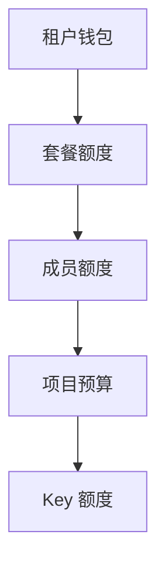

# 五层额度模型

> 🚧 本章节编写中。以下为模型概览，详细规则与示例编写中。

## 额度层级

| 层级 | 控制对象 | 典型用途 |
|------|---------|---------|
| 租户钱包 | 租户总余额 | 租户级消费上限与结算 |
| 套餐额度 | 套餐有效期内的额度 | 套餐内不限项目共享 |
| 成员额度 | 单个成员 | 控制个人用量 |
| 项目预算 | 单个项目 | 项目成本核算 |
| Key 额度 | 单把 Key | 应用 / 环境级限额 |

## 校验顺序

一次请求逐层校验额度，任一层不足即拒绝并返回明确错误码。

## 计划补充内容

- 各层扣减与回补的时序
- 额度与钱包并存的扣费优先级
- 套餐过期 / 升降级时额度的处理
