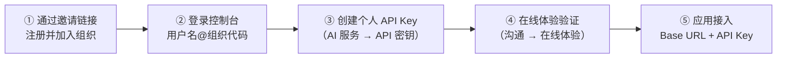

# 租户控制台

租户控制台面向**终端用户**（组织 / 团队），与[管理后台](/guide/admin/)是两套完全独立的账号体系。组织管理员在这里管理成员与项目、签发 API Key、查看用量与账单；成员则聚焦自助使用——签发个人 Key、在线体验模型。

## 角色与权限

| 角色 | 定位 | 典型操作 |
|---|---|---|
| 所有者（owner） | 组织创建者 | 组织设置、成员与项目管理、财务、审计设置 |
| 管理员（admin） | 组织运营者 | 成员与项目管理、Key 管理、用量与审计、财务 |
| 成员（member） | 普通使用者 | 个人 API Key、可用模型、在线体验、个人看板 |

侧边菜单按角色自动显示——成员登录后看不到成员管理、项目管理、请求审计日志等管理页面。

## 个人模式与团队模式

租户注册后默认为**个人模式**：只有所有者自己，没有成员管理。在「组织设置」中设置**组织代码**后自动升级为**团队模式**，解锁成员管理、邀请、成员额度、项目管理等能力。团队相关页面在个人模式下会显示引导提示。

成员登录使用 `用户名@组织代码` 格式；所有者 / 管理员可直接用邮箱登录。

## 模块导览

| 模块 | 说明 | 文档 |
|---|---|---|
| API 密钥 | 个人 Key 的签发、限额、模型范围与吊销 | [API Key 管理](/guide/tenant/api-keys) |
| 成员管理 / 邀请记录 | 邀请、创建、批量导入成员，成员额度与模型授权 | [团队管理](/guide/tenant/team) |
| 项目管理 | 按项目组织 Key，项目预算核算 | [项目管理](/guide/tenant/projects) |
| 请求审计日志 | 组织内全部 API 调用的输入 / 输出审计 | [请求审计日志](/guide/tenant/request-audit-logs) |
| 在线体验 | 对话 / 图像 / 视频 / 语音 / 嵌入 / 重排六类模型在线调试 | [在线体验](/guide/tenant/playground) |
| 可用模型 / 模型对比 | 本组织可调用的模型目录与价格 | 🚧 编写中 |
| 仪表盘 / 个人看板 | 组织级与个人级用量、消费趋势 | 🚧 编写中 |
| 钱包 / 交易 / 订单 / 兑换码 | 充值、消费明细、套餐购买 | 🚧 编写中 |
| 工单 / 反馈 / 帮助中心 | 支持渠道 | 🚧 编写中 |
| 组织设置 / 审计设置 / 登录历史 | 组织级配置 | 🚧 编写中 |

## 新成员上手路径

从收到邀请到发起第一次调用：

应用接入只需两个参数：页面顶部展示的 **Base URL**（`https://你的域名/v1`）与 **API Key**，接口协议见 [OpenAI 兼容接口](/api/openai-compatible)。

::: tip 计费说明
在线体验与 API 调用走同一条计费链路：请求先经[五层额度校验](/guide/quota)（租户钱包 → 套餐 → 成员 → 项目 → Key），任一层不足即拒绝。给成员设好[额度限制](/guide/tenant/team#额度限制)是控制成本的主要手段。
:::

## 相关文档

- [API 参考](/api/openai-compatible) —— 调用协议与参数
- [五层额度模型](/guide/quota) · [计费与对账](/guide/billing) —— 额度与费用规则
- [排障指南](/troubleshooting/) —— 用 Request ID 追查一次调用
