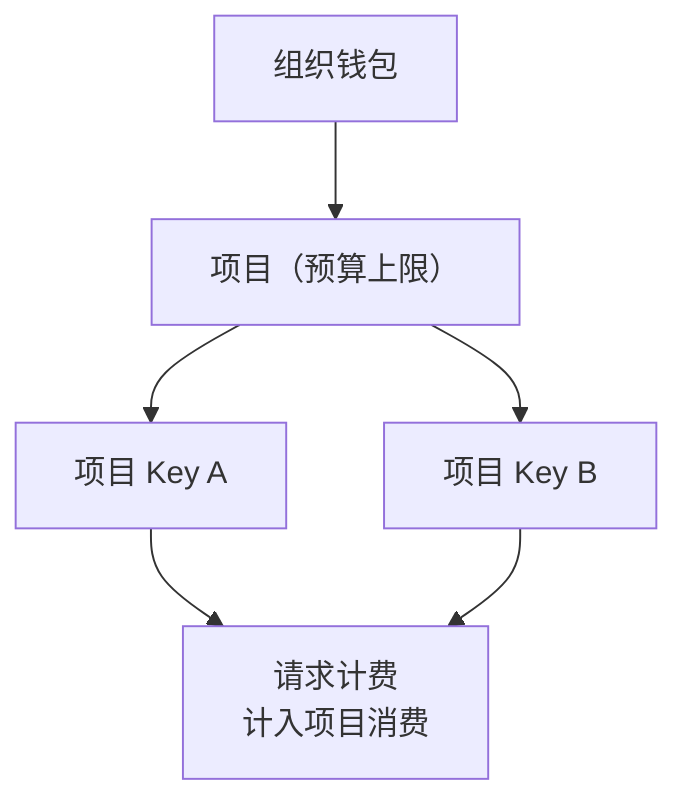

# 项目管理

**租户控制台 → 项目管理**

项目是组织内的**资源与预算单元**：把一组 API Key 归入项目，项目的消费自动汇总，配合**预算上限**实现项目级成本核算与熔断。适合「一个项目 / 产品 / 客户一条预算线」的组织方式。

项目消费与成员额度并行校验：用项目 Key 发起的请求同时计入项目预算，预算耗尽后项目下所有 Key 停止服务。

## 创建与编辑项目

| 字段 | 说明 |
|---|---|
| 项目名称 | 必填 |
| 描述 | 选填 |
| 预算上限（USD） | 0 = 不限制；达到上限后项目下所有 Key 将停止服务 |

预算可在项目详情页随时调整（提高预算立即恢复服务）。

## 项目状态

| 状态 | 说明 |
|---|---|
| 活跃 | 正常服务 |
| 预算耗尽 | 消费达到预算上限，项目下 Key 全部停止服务；提高预算后自动恢复 |
| 已归档 | 手动归档，**项目下所有 Key 立即失效**；可取消归档恢复 |

::: warning 归档的影响
归档是软性下线项目的方式，但会即时停掉项目下全部 Key——正在使用这些 Key 的应用会立刻收到错误。归档前确认没有生产流量在用。
:::

## 项目详情

详情页由「基本信息 / API 密钥 / 用量统计」三个 Tab 组成，分别对应下文的概览、项目密钥与用量。

### 概览

项目基本信息、预算使用进度（按月消费 / 预算计算，70% 起变黄、90% 起变红）、活跃 Key 数、本月请求数与消费汇总。

### 项目密钥

项目级 API Key 的完整管理：创建、编辑、复制明文、禁用，表单与[个人 Key](/guide/tenant/api-keys#创建密钥)完全一致（名称、有效期、可用模型、QPS / 并发 / 额度、IP 白名单）——但额度与消费**计入项目**而非某个成员。

项目 Key 的典型用法：

- 应用接入生产环境，Key 不属于任何个人，人员变动不影响应用；
- 一个项目对应一个产品线，成本直接从项目用量报表读出；
- 项目 Key 可再设自身额度上限，形成「项目预算 → Key 额度」双重控制。

### 用量

项目维度的消费统计与请求日志明细，用于对账与成本分摊。

## 典型场景

- **按产品线核算** —— 为每个产品建项目，月底从各项目用量导出成本报表；
- **外部交付** —— 给客户的接入 Key 放独立项目并设预算，费用隔离、超支自动停；
- **试探性任务** —— 一次性批量任务单独建项目，设小额预算兜底。

## 相关文档

- [API Key 管理](/guide/tenant/api-keys) —— Key 的通用配置说明
- [团队管理](/guide/tenant/team) —— 成员级额度与授权
