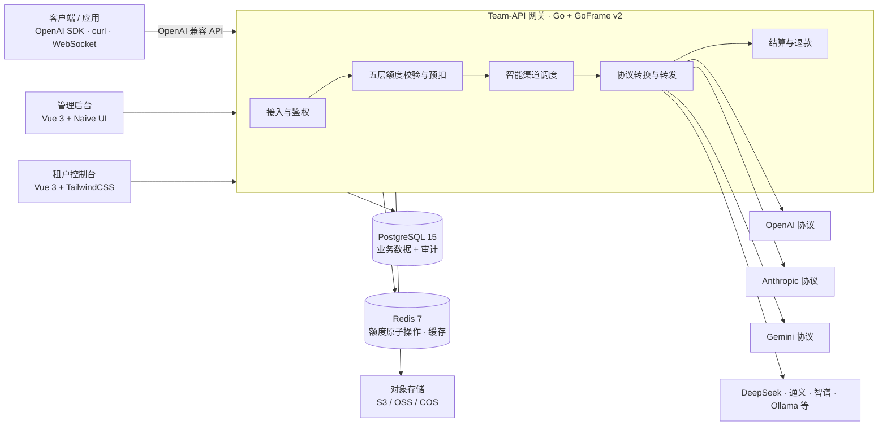
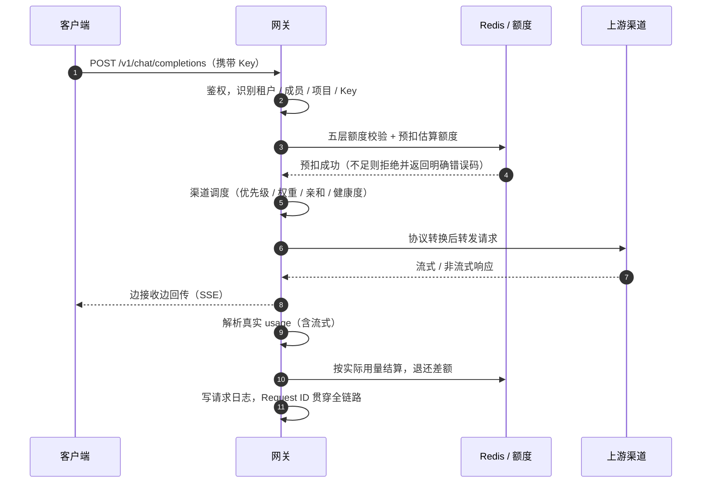
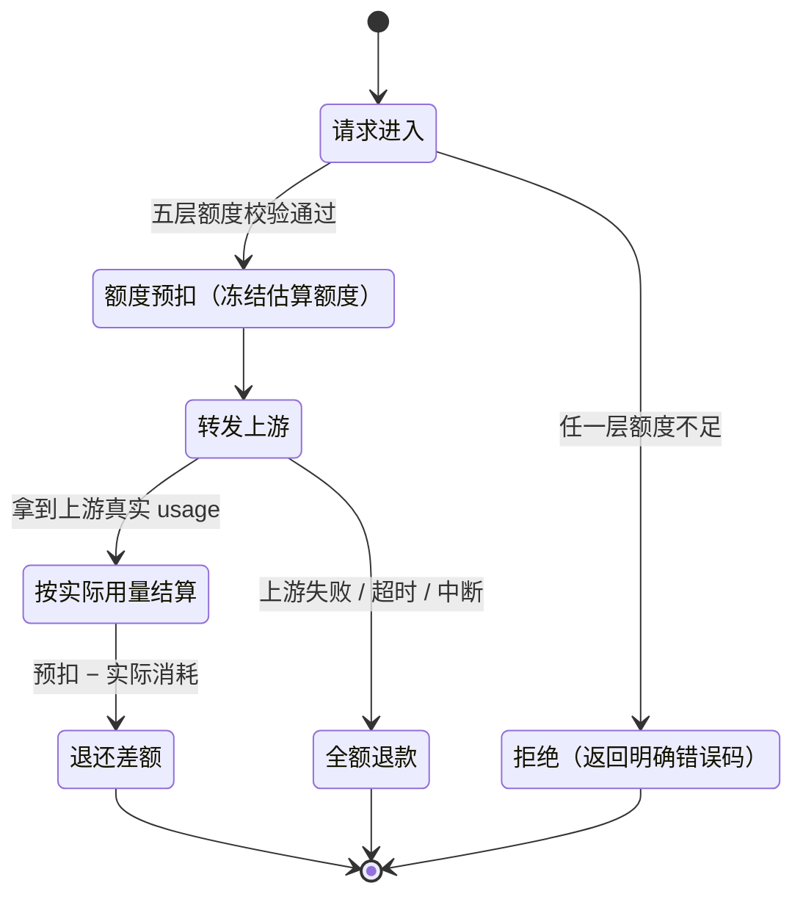
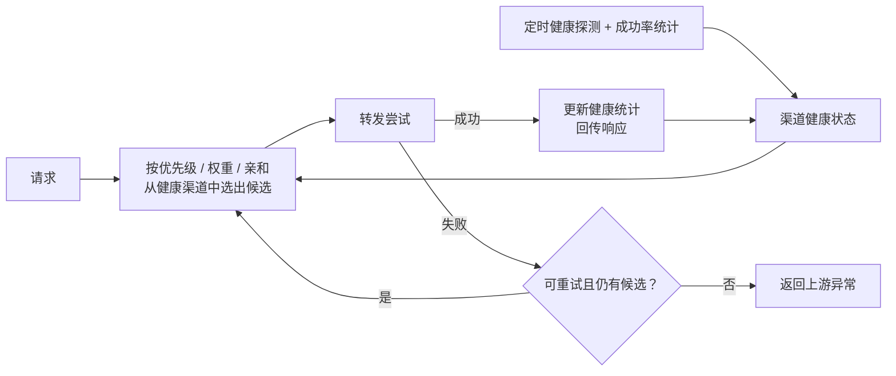

# 架构概览

## 设计目标

Team-API 的架构围绕五个目标展开：

1. **协议兼容优先** —— 对外严格对齐 OpenAI 协议，存量应用零改造迁移；
2. **资金安全** —— 额度与账务操作全部原子化，高并发下不超扣、不错账；
3. **多租户 SaaS 开箱** —— 隔离、套餐、计费、支付等运营能力内建，而非外挂；
4. **全链路可观测** —— 任何一次调用都能用一个 Request ID 追查到底；
5. **部署简单** —— 一条 `docker compose` 命令拉起完整栈，也可单文件二进制部署。

## 整体拓扑

三类流量（客户端 API 调用、管理后台、租户控制台）统一进入网关；网关完成鉴权、额度、调度、转发、计费后落到数据层；对上游则按渠道类型做协议适配。

## 核心模块

| 模块 | 职责 |
|------|------|
| 接入层 | OpenAI 兼容 API、双控制台管理 API、WebSocket 实时通信 |
| 鉴权与身份 | Key 校验、JWT 会话、识别「租户 / 成员 / 项目 / Key」四级身份 |
| 额度引擎 | 五层额度逐层校验、预扣与回补 |
| 调度引擎 | 优先级 / 权重路由、渠道亲和、健康度筛选、故障转移 |
| 代理转发 | 上游协议适配（OpenAI / Anthropic / Gemini 等）、流式回传、用量解析 |
| 计费引擎 | 预扣 → 结算 → 退款四阶段、模型倍率定价 |
| 可观测 | 请求日志、操作审计、监控告警、Request ID 贯穿 |
| 平台服务 | 租户 / 套餐 / 渠道 / 定价管理、支付、在线更新、插件 |

## 一次请求的完整链路

要点：

- **额度先于转发** —— 请求在触达上游之前完成五层校验与预扣，欠费请求不会消耗上游成本；
- **失败即退款** —— 转发失败、超时、中断等异常场景都会触发退款，差额或全额退回；
- **日志贯穿** —— 客户端响应头、网关请求日志、上游转发记录、计费流水使用同一个 Request ID 串联，排障时一处检索、全链路可见（见[排障指南](/troubleshooting/)）。

## 多租户数据隔离

Team-API 采用**行级租户隔离**（而非一租户一库 / 一 Schema）：

- 业务表均携带租户标识，所有查询在数据访问层注入租户作用域，跨租户访问在查询层面被阻断；
- **双独立用户体系** —— 管理后台运营人员与租户控制台成员是两套独立的账号与认证体系，权限边界清晰；
- 租户内部的成员、项目、Key 构成三级归属，配合五层额度模型实现「租户内再隔离」。

行级隔离在运营上最轻：一套库表支撑任意多租户，扩租户零迁移；适合 SaaS 场景下租户数量多、单租户数据量可控的负载形态。

## 双层缓存设计

缓存分为**进程内存**与 **Redis** 两层，各司其职：

| 层 | 存放内容 | 特点 |
|----|---------|------|
| 内存缓存 | 渠道、模型定价、套餐等热点配置 | 微秒级读取，扛住高频鉴权与路由查询 |
| Redis | 额度账本、会话与分布式状态、二级缓存 | 多实例共享，原子操作保证并发安全 |

- 配置类数据在管理后台变更后即时失效，内存缓存随之刷新，避免长 TTL 导致的配置漂移；
- **额度与钱包的扣减、回补全部走 Redis 原子操作**，同一把 Key 的并发请求串行结算，这是计费资金安全的基石；
- 多实例水平扩容时，内存缓存仅作只读加速，权威状态始终在 Redis 与 PostgreSQL。

## 计费引擎状态机

每次请求的额度生命周期如下，任何异常出口都保证资金回到用户侧：

| 场景 | 处理 |
|------|------|
| 转发前额度不足 | 直接拒绝，不产生任何扣费 |
| 上游失败 / 超时 | 冻结额度全额退回 |
| 实际用量 < 预扣 | 结算实际用量，差额即时退回 |
| 流式响应 | 按流式协议解析真实 usage 后结算 |

计费规则、模型倍率与对账细节见[计费与对账](/guide/billing)。

## 渠道健康与故障转移

调度引擎按「候选 → 尝试 → 反馈」的闭环工作：

- **健康筛选前置** —— 异常渠道在选择阶段即被摘除，不浪费重试预算；
- **失败转移** —— 转发失败自动切换下一候选，同优先级按权重分流；
- **自动恢复** —— 健康探测通过后渠道自动回到可用池，无需人工干预；
- **会话亲和** —— 同一会话尽量命中同一渠道，保证上下文与风格连续。

## 数据存储

| 存储 | 用途 | 说明 |
|------|------|------|
| PostgreSQL 15 | 业务主库 | 租户、渠道、套餐、Key、计费流水等结构化数据 |
| PostgreSQL（独立实例，可选） | 审计日志库 | 大模型请求审计 `aud_request_logs` 写入频繁、体量大，可配置独立连接物理隔离，其余审计表（操作日志、登录历史、敏感数据访问、内容过滤）仍留主库 |
| Redis 7 | 额度账本与缓存 | 钱包与额度的原子操作、缓存、分布式锁；计费相关建议开启 AOF 持久化 |
| 对象存储 | 文件类数据 | S3 兼容存储 / 阿里云 OSS / 腾讯云 COS |

数据库 Schema 由 [Goose](https://github.com/pressly/goose) 统一管理版本化迁移，升级时自动执行，连接与调优见[运行配置 config.yaml](/config/config-yaml)。

## 前端与部署形态

两个控制台均为独立 SPA：

- **管理后台** —— Vue 3 + Vite + Naive UI + TailwindCSS；
- **租户控制台** —— Vue 3 + Vite + TailwindCSS。

支持三种部署形态（详见[部署章节](/deploy/docker-compose)）：

| 形态 | 适用 | 说明 |
|------|------|------|
| Docker Compose | 推荐 | PostgreSQL + Redis + App 一键编排，多阶段构建（bun 前端 → Go 编译 → Alpine 运行） |
| 单文件二进制 | 极简部署 | 前端资源嵌入二进制（`make build-all`），配合外部数据库即可运行，支持交叉编译 |
| 源码编译 | 二次开发 | Go 1.25+ + GoFrame CLI，`gf` 代码生成 + Makefile 全流程 |

生产环境建议在网关前加 Nginx 反向代理终结 HTTPS，流式接口需关闭缓冲，见[Nginx 反向代理](/deploy/nginx)与[宝塔部署](/deploy/baota)。

## 延伸阅读

- [Docker Compose 部署](/deploy/docker-compose) —— 5 分钟跑起完整栈
- [运行配置](/config/config-yaml) · [系统设置](/config/settings-overview) —— 全部配置项
- [五层额度模型](/guide/quota) · [计费与对账](/guide/billing) —— 核心业务规则
- [排障指南](/troubleshooting/) —— Request ID 全链路排查
